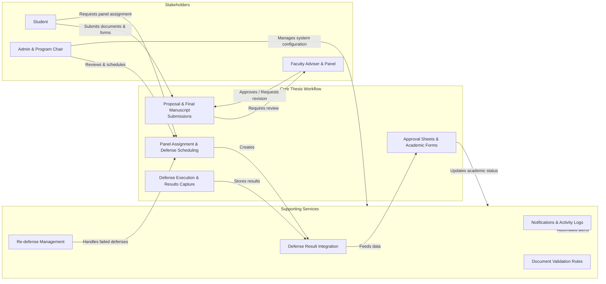

## Figure 3.1 Framework of the Study

```mermaid
flowchart LR
    subgraph Stakeholders
        A[Student]
        B[Faculty Adviser & Panel]
        C[Admin & Program Chair]
    end

    subgraph CoreWorkflow[Core Thesis Workflow]
        W1[Proposal & Final Manuscript\nSubmissions]
        W2[Panel Assignment & Defense Scheduling]
        W3[Defense Execution & Results Capture]
        W4[Approval Sheets & Academic Forms]
    end

    subgraph SupportSystems[Supporting Services]
        S1[Notifications & Activity Logs]
        S2[Document Validation Rules]
        S3[Defense Result Integration]
        S4[Re-defense Management]
    end

    A -->|Submits documents & forms| W1
    W1 -->|Requires review| B
    B -->|Approves / Requests revision| W1

    A -->|Requests panel assignment| W2
    C -->|Reviews & schedules| W2
    W2 -->|Creates| S3

    W3 -->|Stores results| S3
    S3 -->|Feeds data| W4
    W4 -->|Updates academic status| SupportSystems

    SupportSystems -->|Automated alerts| S1
    S4 -->|Handles failed defenses| W2
    C -->|Manages system configuration| SupportSystems
```
