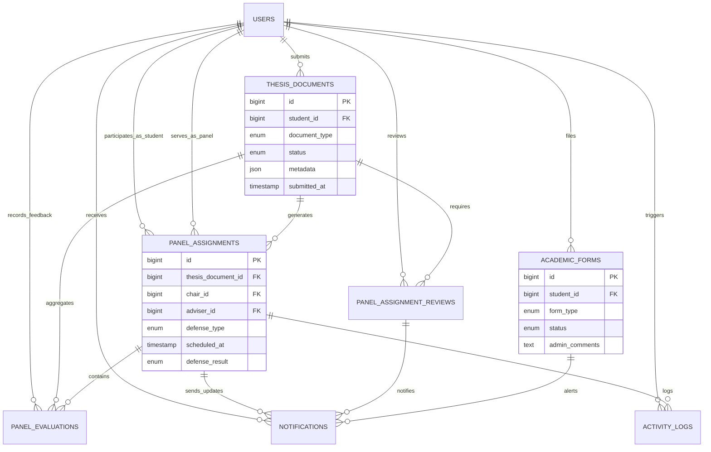

## Figure 3.2.2 Entity Relationship Diagram

```mermaid
erDiagram
    USERS ||--o{ THESIS_DOCUMENTS : submits
    USERS ||--o{ ACADEMIC_FORMS : files
    USERS ||--o{ PANEL_ASSIGNMENTS : participates_as_student
    USERS ||--o{ PANEL_ASSIGNMENTS : serves_as_panel
    USERS ||--o{ PANEL_ASSIGNMENT_REVIEWS : reviews
    USERS ||--o{ PANEL_EVALUATIONS : records_feedback
    USERS ||--o{ NOTIFICATIONS : receives
    USERS ||--o{ ACTIVITY_LOGS : triggers

    THESIS_DOCUMENTS ||--o{ PANEL_ASSIGNMENTS : generates
    THESIS_DOCUMENTS ||--o{ PANEL_ASSIGNMENT_REVIEWS : requires
    THESIS_DOCUMENTS ||--o{ PANEL_EVALUATIONS : aggregates

    PANEL_ASSIGNMENTS ||--o{ PANEL_EVALUATIONS : contains
    PANEL_ASSIGNMENTS ||--o{ NOTIFICATIONS : sends_updates
    PANEL_ASSIGNMENTS ||--o{ ACTIVITY_LOGS : logs

    PANEL_ASSIGNMENT_REVIEWS ||--o{ NOTIFICATIONS : notifies
    ACADEMIC_FORMS ||--o{ NOTIFICATIONS : alerts

    THESIS_DOCUMENTS {
        bigint id PK
        bigint student_id FK
        enum document_type
        enum status
        json metadata
        timestamp submitted_at
    }

    PANEL_ASSIGNMENTS {
        bigint id PK
        bigint thesis_document_id FK
        bigint chair_id FK
        bigint adviser_id FK
        enum defense_type
        timestamp scheduled_at
        enum defense_result
    }

    ACADEMIC_FORMS {
        bigint id PK
        bigint student_id FK
        enum form_type
        enum status
        text admin_comments
    }
```
