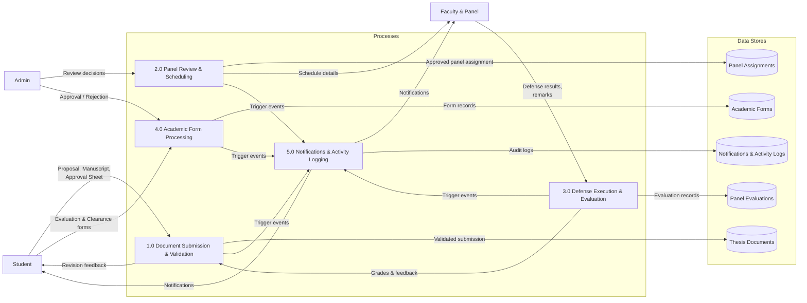

## Figure 3.2.4 Data Flow Diagram

```mermaid
flowchart LR
    STUD[Student]
    FAC[Faculty & Panel]
    ADM[Admin]

    subgraph Process[Processes]
        P1[1.0 Document Submission & Validation]
        P2[2.0 Panel Review & Scheduling]
        P3[3.0 Defense Execution & Evaluation]
        P4[4.0 Academic Form Processing]
        P5[5.0 Notifications & Activity Logging]
    end

    subgraph DataStores[Data Stores]
        D1[(Thesis Documents)]
        D2[(Panel Assignments)]
        D3[(Panel Evaluations)]
        D4[(Academic Forms)]
        D5[(Notifications & Activity Logs)]
    end

    STUD -->|Proposal, Manuscript,\nApproval Sheet| P1
    P1 -->|Validated submission| D1
    P1 -->|Revision feedback| STUD

    ADM -->|Review decisions| P2
    P2 -->|Approved panel assignment| D2
    P2 -->|Schedule details| FAC

    FAC -->|Defense results,\nremarks| P3
    P3 -->|Evaluation records| D3
    P3 -->|Grades & feedback| P1

    STUD -->|Evaluation & Clearance forms| P4
    P4 -->|Form records| D4
    ADM -->|Approval / Rejection| P4

    P1 -->|Trigger events| P5
    P2 -->|Trigger events| P5
    P3 -->|Trigger events| P5
    P4 -->|Trigger events| P5

    P5 -->|Notifications| STUD
    P5 -->|Notifications| FAC
    P5 -->|Audit logs| D5
```
