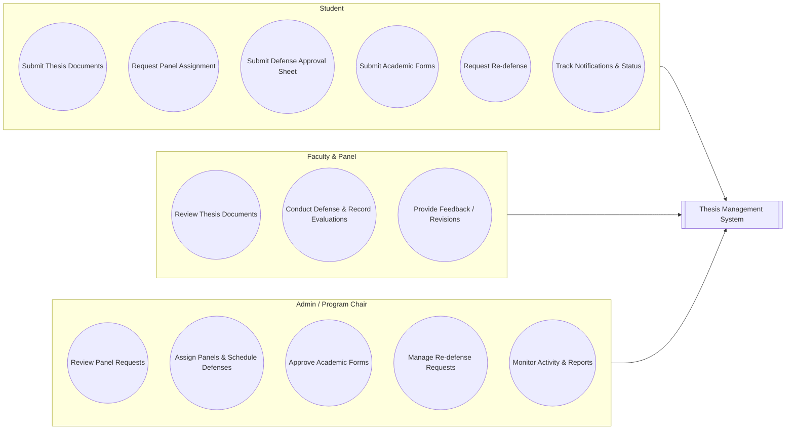

## Figure 3.2.5 Use Case Diagram

```mermaid
%% Mermaid does not have native use-case notation, so we approximate using flowchart clusters.
flowchart LR
    subgraph StudentRole[Student]
        UC1((Submit Thesis Documents))
        UC2((Request Panel Assignment))
        UC3((Submit Defense Approval Sheet))
        UC4((Submit Academic Forms))
        UC5((Request Re-defense))
        UC6((Track Notifications & Status))
    end

    subgraph FacultyRole[Faculty & Panel]
        UC7((Review Thesis Documents))
        UC8((Conduct Defense & Record Evaluations))
        UC9((Provide Feedback / Revisions))
    end

    subgraph AdminRole[Admin / Program Chair]
        UC10((Review Panel Requests))
        UC11((Assign Panels & Schedule Defenses))
        UC12((Approve Academic Forms))
        UC13((Manage Re-defense Requests))
        UC14((Monitor Activity & Reports))
    end

    System[[Thesis Management System]]

    StudentRole --> System
    FacultyRole --> System
    AdminRole --> System
```
