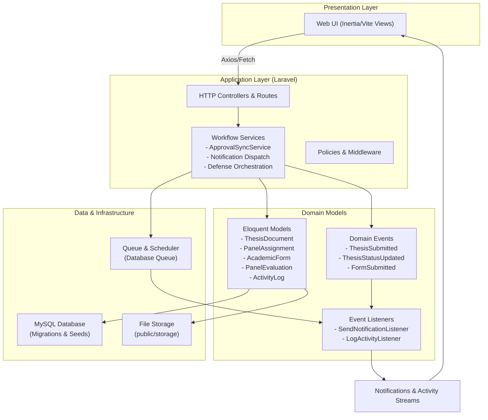

## Figure 3.2 System Architecture

```mermaid
flowchart TB
    subgraph Presentation["Presentation Layer"]
        Browser["Web UI (Inertia/Vite Views)"]
    end

    subgraph Application["Application Layer (Laravel)"]
        Controllers["HTTP Controllers & Routes"]
        Services["Workflow Services\n- ApprovalSyncService\n- Notification Dispatch\n- Defense Orchestration"]
        Policies["Policies & Middleware"]
    end

    subgraph Domain["Domain Models"]
        Models["Eloquent Models\n- ThesisDocument\n- PanelAssignment\n- AcademicForm\n- PanelEvaluation\n- ActivityLog"]
        Events["Domain Events\n- ThesisSubmitted\n- ThesisStatusUpdated\n- FormSubmitted"]
        Listeners["Event Listeners\n- SendNotificationListener\n- LogActivityListener"]
    end

    subgraph Data["Data & Infrastructure"]
        Database["MySQL Database\n(Migrations & Seeds)"]
        Storage["File Storage\n(public/storage)"]
        Queue["Queue & Scheduler\n(Database Queue)"]
    end

    Browser -->|Axios/Fetch| Controllers
    Controllers --> Services
    Services --> Models
    Models --> Database
    Models --> Storage
    Services --> Events
    Events --> Listeners
    Listeners --> Notifications["Notifications & Activity Streams"]
    Notifications --> Browser
    Services --> Queue
    Queue --> Listeners
```
