# Complete Thesis Management System - High-Level Workflow

## System Overview
This document provides the complete, corrected workflow for the thesis management system that addresses all compliance issues identified in the analysis.

## 🔄 Complete System Workflow Diagram

```mermaid
graph TD
    %% Main Workflow (Left Side)
    A[Submit Proposal Document] --> B{Adviser Review}
    B -->|Approved| C[Submit Panel Assignment Request]
    B -->|Rejected/Revision| A
    
    C --> D{Admin Reviews Panel Assignment Request}
    D -->|Approved| E[Admin Assigns Panel & Schedules Defense]
    D -->|Rejected/Revision| C
    
    E --> F[Student Attends Defense]
    F --> G[Student Marks Defense Complete]
    G --> H[Submit Approval Sheet with Defense Results & Grades]
    H --> I{Faculty Review Approval Sheet}
    I -->|Approved| J[Submit Final Manuscript]
    I -->|Rejected/Revision| H
    
    J --> K{Faculty Review Final Manuscript}
    K -->|Approved| L[Submit Final Panel Assignment Request]
    K -->|Rejected/Revision| J
    
    L --> M{Admin Reviews Final Panel Assignment Request}
    M -->|Approved| N[Admin Assigns Final Panel & Schedules Defense]
    M -->|Rejected/Revision| L
    
    N --> O[Student Attends Final Defense]
    O --> P[Student Marks Final Defense Complete]
    P --> Q[Submit Final Approval Sheet with Defense Results & Grades]
    Q --> R{Faculty Review Final Approval Sheet}
    R -->|Approved| S[Submit Evaluation Form]
    R -->|Rejected/Revision| Q
    
    S --> T{Admin Review Evaluation}
    T -->|Approved| U[Submit Clearance Form]
    T -->|Rejected/Revision| S
    U --> V{Admin Review Clearance}
    V -->|Approved| W[Completed ✅]
    V -->|Rejected/Revision| U
    
    %% Re-defense Scenarios (Right Side)
    F -->|Failed| X[Request Re-defense]
    X --> Y{Admin Reviews Re-defense Request}
    Y -->|Approved| Z[Admin Assigns Re-defense Panel]
    Y -->|Rejected| X
    Z --> AA[Admin Schedules Re-defense]
    AA --> BB[Student Attends Re-defense]
    BB --> CC{Re-defense Result}
    CC -->|Pass| H
    CC -->|Fail| X
    
    O -->|Failed| DD[Request Final Re-defense]
    DD --> EE{Admin Reviews Final Re-defense Request}
    EE -->|Approved| FF[Admin Assigns Final Re-defense Panel]
    EE -->|Rejected| DD
    FF --> GG[Admin Schedules Final Re-defense]
    GG --> HH[Student Attends Final Re-defense]
    HH --> II{Final Re-defense Result}
    II -->|Pass| Q
    II -->|Fail| DD
```

