# Complete Thesis Management System - High-Level Workflow

## System Overview
This document provides the complete, corrected workflow for the thesis management system that addresses all compliance issues identified in the analysis.

## 🔄 Complete System Workflow Diagram

```mermaid
graph TD
    %% Main Workflow (Left Side)
    A[Submit Proposal Document] --> B{Adviser Review}
    B -->|Approved| C[Submit Panel Assignment Request]
    B -->|Rejected/Revision| A
    
    C --> D{Admin Reviews Panel Assignment Request}
    D -->|Approved| E[Admin Assigns Panel & Schedules Defense]
    D -->|Rejected/Revision| C
    
    E --> F[Student Attends Defense]
    F --> G[Student Marks Defense Complete]
    G --> H[Submit Approval Sheet with Defense Results & Grades]
    H --> I{Faculty Review Approval Sheet}
    I -->|Approved| J[Submit Final Manuscript]
    I -->|Rejected/Revision| H
    
    J --> K{Faculty Review Final Manuscript}
    K -->|Approved| L[Submit Final Panel Assignment Request]
    K -->|Rejected/Revision| J
    
    L --> M{Admin Reviews Final Panel Assignment Request}
    M -->|Approved| N[Admin Assigns Final Panel & Schedules Defense]
    M -->|Rejected/Revision| L
    
    N --> O[Student Attends Final Defense]
    O --> P[Student Marks Final Defense Complete]
    P --> Q[Submit Final Approval Sheet with Defense Results & Grades]
    Q --> R{Faculty Review Final Approval Sheet}
    R -->|Approved| S[Submit Evaluation Form]
    R -->|Rejected/Revision| Q
    
    S --> T{Faculty Review Evaluation}
    T -->|Approved| U[Submit Clearance Form]
    T -->|Rejected/Revision| S
    U --> V{Faculty Review Clearance}
    V -->|Approved| W[Graduation Complete ✅]
    V -->|Rejected/Revision| U
    
    %% Re-defense Scenarios (Right Side)
    F -->|Failed| X[Request Re-defense]
    X --> Y{Admin Reviews Re-defense Request}
    Y -->|Approved| Z[Admin Assigns Re-defense Panel]
    Y -->|Rejected| X
    Z --> AA[Admin Schedules Re-defense]
    AA --> BB[Student Attends Re-defense]
    BB --> CC{Re-defense Result}
    CC -->|Pass| H
    CC -->|Fail| X
    
    O -->|Failed| DD[Request Final Re-defense]
    DD --> EE{Admin Reviews Final Re-defense Request}
    EE -->|Approved| FF[Admin Assigns Final Re-defense Panel]
    EE -->|Rejected| DD
    FF --> GG[Admin Schedules Final Re-defense]
    GG --> HH[Student Attends Final Re-defense]
    HH --> II{Final Re-defense Result}
    II -->|Pass| Q
    II -->|Fail| DD
```



## 📋 Complete Workflow Phases

### **Academic Forms Process (Parallel to Thesis Workflow)**

#### **Registration Form**
- Student submits Registration Form (`form_type: 'registration'`)
- Includes subjects, units, GPA, scholarship status
- Faculty reviews registration
- **Decision**: Approved / Rejected / Needs Revision
- If approved: Student can proceed with thesis work

#### **Evaluation Form** (After Thesis Completion)
- Student submits Evaluation Form (`form_type: 'evaluation'`)
- Includes completed subjects, grades, thesis status
- Faculty reviews evaluation
- **Decision**: Approved / Rejected / Needs Revision
- If approved: Ready for clearance process

#### **Clearance Form** (Final Step)
- Student submits Clearance Form (`form_type: 'clearance'`)
- Includes clearance type, graduation details, obligations
- Faculty reviews clearance
- **Decision**: Approved / Rejected / Needs Revision
- If approved: **Graduation Complete ✅**

### **Phase 1: Proposal Defense Stage**

#### **Step 1: Proposal Submission**
- Student submits Proposal Document (`document_type: 'proposal'`)
- System validates proposal requirements
- Adviser receives notification for review

#### **Step 2: Adviser Review**
- Adviser reviews proposal
- **Decision**: Approved / Rejected / Needs Revision
- If rejected/revision: Student must resubmit
- If approved: Proceed to next step

#### **Step 3: Panel Assignment Request**
- Student submits Panel Assignment Request (`document_type: 'panel_assignment'`)
- Includes preferred panel members, justification, special requirements
- System validates request completeness

#### **Step 4: Admin Review Panel Request**
- Admin reviews panel assignment request
- **Decision**: Approved / Rejected / Needs Revision
- If rejected/revision: Student must resubmit
- If approved: Proceed to panel assignment

#### **Step 5: Panel Assignment & Defense Scheduling**
- Admin assigns panel members (Chair, Secretary, Panel Members)
- Admin schedules defense (date, time, venue)
- System creates PanelAssignment with `defense_type: 'proposal_defense'`
- All panel members receive notifications

#### **Step 6: Defense Execution**
- Student attends proposal defense
- Panel members evaluate student performance
- Student marks defense as completed

#### **Step 7: Approval Sheet Submission**
- Student submits Approval Sheet (`document_type: 'approval_sheet'`)
- **MUST include**: Defense results, grades, panel recommendations
- **Timing**: Only after defense completion
- System validates defense completion requirement

#### **Step 8: Faculty Review Approval Sheet**
- Faculty reviews approval sheet with defense results
- **Decision**: Approved / Rejected / Needs Revision
- If approved: Ready for final manuscript phase

### **Phase 2: Final Defense Stage**

#### **Step 9: Final Manuscript Submission**
- Student submits Final Manuscript (`document_type: 'final_manuscript'`)
- System validates manuscript requirements
- Faculty receives notification for review

#### **Step 10: Faculty Review Final Manuscript**
- Faculty reviews final manuscript
- **Decision**: Approved / Rejected / Needs Revision
- If rejected/revision: Student must resubmit
- If approved: Proceed to final panel assignment

#### **Step 11: Final Panel Assignment Request**
- Student submits Final Panel Assignment Request (`document_type: 'panel_assignment'`)
- Includes preferred panel members for final defense
- System validates request completeness

#### **Step 12: Admin Review Final Panel Request**
- Admin reviews final panel assignment request
- **Decision**: Approved / Rejected / Needs Revision
- If rejected/revision: Student must resubmit
- If approved: Proceed to final panel assignment

#### **Step 13: Final Panel Assignment & Defense Scheduling**
- Admin assigns final panel members
- Admin schedules final defense
- System creates PanelAssignment with `defense_type: 'final_defense'`
- All panel members receive notifications

#### **Step 14: Final Defense Execution**
- Student attends final defense
- Panel members evaluate student performance
- Student marks final defense as completed

#### **Step 15: Final Approval Sheet Submission**
- Student submits Final Approval Sheet (`document_type: 'approval_sheet'`)
- **MUST include**: Final defense results, grades, panel recommendations
- **Timing**: Only after final defense completion
- System validates final defense completion requirement

#### **Step 16: Faculty Review Final Approval Sheet**
- Faculty reviews final approval sheet with defense results
- **Decision**: Approved / Rejected / Needs Revision
- If approved: **Thesis Process Complete ✅**

### **Phase 3: Re-defense Scenarios**

#### **Proposal Re-defense Process**
1. **Re-defense Request**: Student requests re-defense after failed proposal defense
2. **Admin Review**: Admin reviews re-defense request
3. **Panel Assignment**: Admin assigns re-defense panel (`defense_type: 'redefense'`)
4. **Defense Scheduling**: Admin schedules re-defense
5. **Re-defense Execution**: Student attends re-defense
6. **Result**: Pass → Submit Approval Sheet / Fail → Request Another Re-defense

#### **Final Re-defense Process**
1. **Final Re-defense Request**: Student requests re-defense after failed final defense
2. **Admin Review**: Admin reviews final re-defense request
3. **Panel Assignment**: Admin assigns final re-defense panel (`defense_type: 'redefense'`)
4. **Defense Scheduling**: Admin schedules final re-defense
5. **Re-defense Execution**: Student attends final re-defense
6. **Result**: Pass → Submit Final Approval Sheet / Fail → Request Another Re-defense

## 🔧 Required System Updates

### **1. Workflow Sequence Corrections**

#### **A. Fix Document Submission Order**
```php
// Current (INCORRECT):
Proposal → Approval Sheet → Panel Request → Defense

// Required (CORRECT):
Proposal → Panel Request → Defense → Approval Sheet
```

#### **B. Add Admin Review Step**
- Create admin review interface for panel assignment requests
- Add approval/rejection workflow for panel requests
- Prevent direct panel assignment without review

#### **C. Fix Approval Sheet Timing**
- Restrict approval sheet submission to only after defense completion
- Integrate defense results into approval sheet data
- Update UI to show correct submission order

### **2. New Features Required**

#### **A. Admin Panel Request Review System**
```php
// New Controller: AdminPanelRequestController
- index() - List all panel assignment requests
- show() - Review specific panel request
- approve() - Approve panel request
- reject() - Reject panel request with feedback
- requestRevision() - Request revisions from student
```

#### **B. Re-defense Request System**
```php
// New Controller: StudentRedefenseController
- create() - Show re-defense request form
- store() - Submit re-defense request
- show() - View re-defense request status

// New Controller: AdminRedefenseController
- index() - List all re-defense requests
- show() - Review re-defense request
- approve() - Approve re-defense request
- reject() - Reject re-defense request
```

#### **C. Enhanced Defense Result Integration**
```php
// Update ThesisDocument model
- Add defense_result field
- Add defense_grade field
- Add panel_evaluations field
- Add defense_feedback field

// Update Approval Sheet submission
- Auto-populate with defense results
- Include panel member evaluations
- Add defense grade and feedback
```

#### **D. Academic Forms Integration**
```php
// Existing AcademicFormController (Already Implemented)
- index() - List available forms
- create() - Show form creation page
- store() - Submit academic form
- history() - View form submission history
- show() - View specific form details

// Academic Forms Types (Already Implemented)
- Registration Form (form_type: 'registration')
- Clearance Form (form_type: 'clearance') 
- Evaluation Form (form_type: 'evaluation')

// Integration Points
- Link evaluation form to thesis completion status
- Include thesis status in evaluation form data
- Connect clearance form to final approval sheets
```

### **3. Database Schema Updates**

#### **A. Add Panel Request Review Fields**
```sql
ALTER TABLE thesis_documents ADD COLUMN admin_review_status ENUM('pending', 'approved', 'rejected', 'needs_revision') DEFAULT 'pending';
ALTER TABLE thesis_documents ADD COLUMN admin_reviewed_by INT NULL;
ALTER TABLE thesis_documents ADD COLUMN admin_reviewed_at TIMESTAMP NULL;
ALTER TABLE thesis_documents ADD COLUMN admin_review_comments TEXT NULL;
```

#### **B. Add Re-defense Request Table**
```sql
CREATE TABLE redefense_requests (
    id BIGINT PRIMARY KEY AUTO_INCREMENT,
    student_id BIGINT NOT NULL,
    panel_assignment_id BIGINT NOT NULL,
    request_type ENUM('proposal_redefense', 'final_redefense') NOT NULL,
    reason TEXT NOT NULL,
    status ENUM('pending', 'approved', 'rejected') DEFAULT 'pending',
    admin_reviewed_by INT NULL,
    admin_reviewed_at TIMESTAMP NULL,
    admin_comments TEXT NULL,
    created_at TIMESTAMP DEFAULT CURRENT_TIMESTAMP,
    updated_at TIMESTAMP DEFAULT CURRENT_TIMESTAMP ON UPDATE CURRENT_TIMESTAMP,
    FOREIGN KEY (student_id) REFERENCES users(id),
    FOREIGN KEY (panel_assignment_id) REFERENCES panel_assignments(id),
    FOREIGN KEY (admin_reviewed_by) REFERENCES users(id)
);
```

#### **C. Enhanced Defense Results**
```sql
ALTER TABLE panel_assignments ADD COLUMN defense_result ENUM('passed', 'failed', 'conditional') NULL;
ALTER TABLE panel_assignments ADD COLUMN defense_grade DECIMAL(5,2) NULL;
ALTER TABLE panel_assignments ADD COLUMN panel_evaluations JSON NULL;
ALTER TABLE panel_assignments ADD COLUMN defense_feedback TEXT NULL;
```

## 🎯 Implementation Priority

### **Phase 1: Critical Fixes (Week 1-2)**
1. Fix workflow sequence validation
2. Implement admin review for panel requests
3. Fix approval sheet timing restrictions

### **Phase 2: Re-defense System (Week 3-4)**
1. Create re-defense request system
2. Add admin approval process
3. Implement re-defense scheduling

### **Phase 3: Enhanced Integration (Week 5-6)**
1. Integrate defense results into approval sheets
2. Add comprehensive validation
3. Update UI/UX for new workflow

### **Phase 4: Testing & Refinement (Week 7-8)**
1. End-to-end testing
2. User acceptance testing
3. Performance optimization

## 📊 Expected Compliance After Updates

| Category | Current | After Updates | Improvement |
|----------|---------|---------------|-------------|
| Workflow Sequence | 40% | 100% | +60% |
| Admin Review Process | 30% | 100% | +70% |
| Re-defense System | 20% | 100% | +80% |
| Defense Result Integration | 60% | 100% | +40% |
| Academic Forms Integration | 90% | 100% | +10% |
| **Overall Compliance** | **65%** | **100%** | **+35%** |

## 🚀 Benefits of Complete Implementation

1. **Full Workflow Compliance**: System matches documented workflow exactly
2. **Proper Approval Chain**: All requests go through proper review process
3. **Complete Re-defense Support**: Students can request re-defense when needed
4. **Integrated Defense Results**: Approval sheets contain complete defense information
5. **Academic Forms Integration**: Complete academic process from registration to graduation
6. **Better User Experience**: Clear workflow progression and status tracking
7. **Audit Trail**: Complete tracking of all workflow steps and decisions

## 📋 Complete System Components

### **Thesis Management System**
- **Thesis Documents**: Proposal, Approval Sheets, Panel Assignment Requests, Final Manuscripts
- **Panel Assignments**: Defense scheduling and management
- **Defense Management**: Defense execution and result tracking
- **Re-defense System**: Failed defense recovery process

### **Academic Forms System**
- **Registration Forms**: Course registration and enrollment
- **Evaluation Forms**: Academic progress and thesis status evaluation
- **Clearance Forms**: Graduation clearance and final requirements

### **User Management**
- **Students**: Document submission, form submission, defense attendance
- **Faculty**: Document review, form review, panel participation
- **Admins**: Panel assignment, defense scheduling, system management

This complete implementation will bring the system to 100% compliance with the documented workflow requirements, including both thesis management and academic forms processes.
