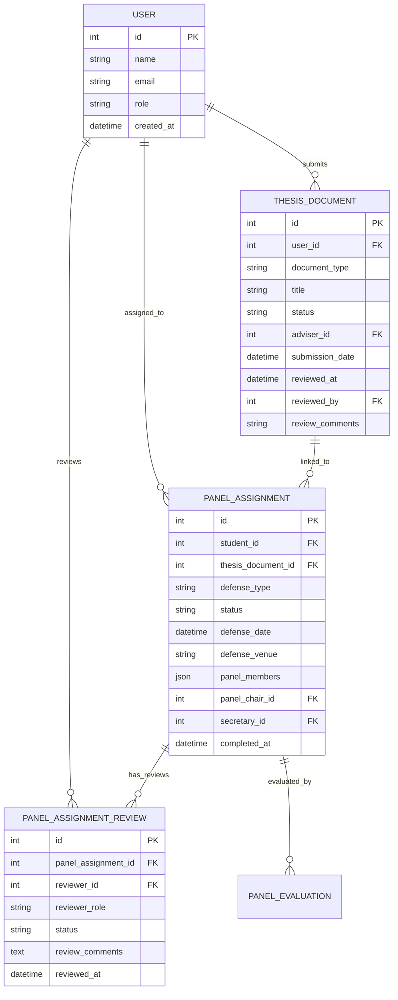
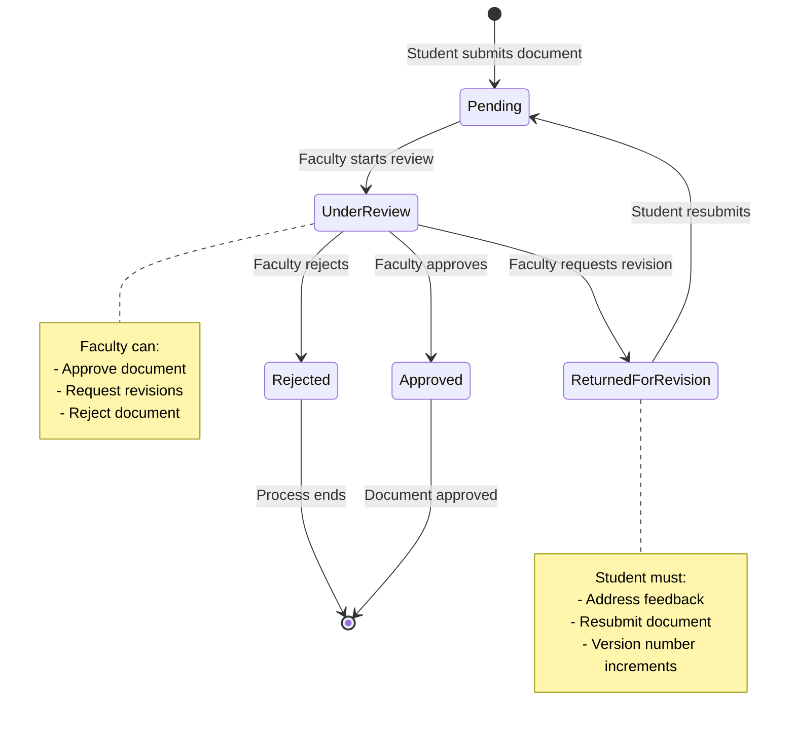
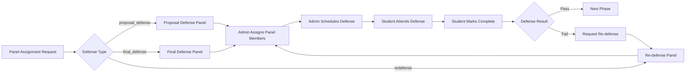
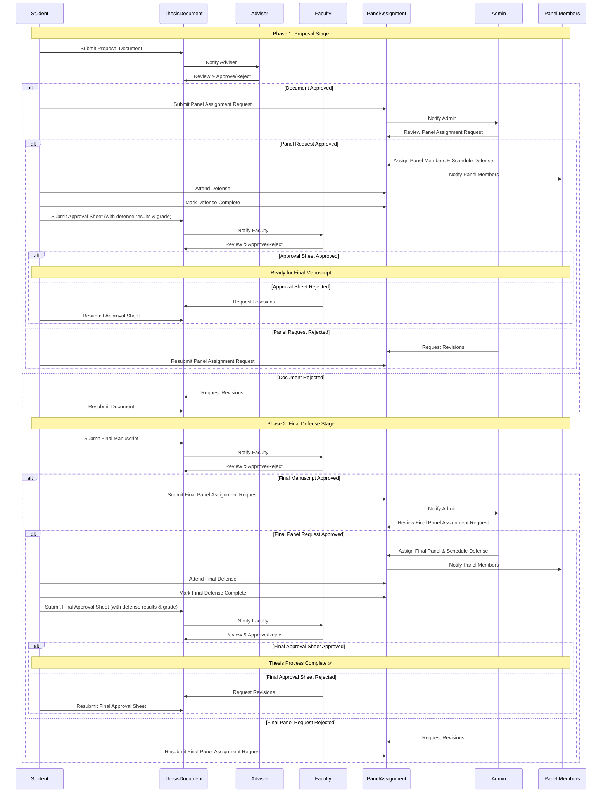

# Thesis Management System - Data Flow Diagram

## High-Level Data Flow Overview

```mermaid
graph TD
    A[Student] --> B[Submit Proposal Document]
    B --> C{Adviser Review}
    C -->|Approved| D[Submit Panel Assignment Request]
    C -->|Rejected/Revision| B
    D --> E{Admin Reviews Panel Assignment Request}
    E -->|Approved| F[Admin Assigns Panel & Schedules Defense]
    E -->|Rejected/Revision| D
    F --> G[Student Attends Defense]
    G --> H[Student Marks Defense Complete]
    H --> I[Submit Approval Sheet with Defense Results & Grades]
    I --> J{Faculty Review Approval Sheet}
    J -->|Approved| K[Submit Final Manuscript]
    J -->|Rejected/Revision| I
    K --> L{Faculty Review Final Manuscript}
    L -->|Approved| M[Submit Final Panel Assignment Request]
    L -->|Rejected/Revision| K
    M --> N{Admin Reviews Final Panel Assignment Request}
    N -->|Approved| O[Admin Assigns Final Panel & Schedules Defense]
    N -->|Rejected/Revision| M
    O --> P[Student Attends Final Defense]
    P --> Q[Student Marks Final Defense Complete]
    Q --> R[Submit Final Approval Sheet with Defense Results & Grades]
    R --> S{Faculty Review Final Approval Sheet}
    S -->|Approved| T[Thesis Process Complete ✅]
    S -->|Rejected/Revision| R

    %% Re-defense scenarios
    G -->|Failed| U[Request Re-defense]
    U --> V[Admin Assigns Re-defense Panel]
    V --> W[Admin Schedules Re-defense]
    W --> X[Student Attends Re-defense]
    X --> Y{Re-defense Result}
    Y -->|Pass| I
    Y -->|Fail| U

    P -->|Failed| Z[Request Final Re-defense]
    Z --> AA[Admin Assigns Final Re-defense Panel]
    AA --> BB[Admin Schedules Final Re-defense]
    BB --> CC[Student Attends Final Re-defense]
    CC --> DD{Final Re-defense Result}
    DD -->|Pass| R
    DD -->|Fail| Z
```

## Detailed Entity Relationship Flow

## Document Types and Status Flow

## Defense Types and Panel Assignment Flow

## Key Data Entities and Their Relationships

### 1. **User Entity**
- **Students**: Submit documents, attend defenses
- **Faculty**: Review documents, serve on panels
- **Admins**: Assign panels, schedule defenses

### 2. **ThesisDocument Entity**
- **Document Types**: proposal, approval_sheet, panel_assignment, final_manuscript
- **Status Flow**: pending → under_review → approved/rejected/returned_for_revision
- **Review Process**: Adviser reviews, faculty reviews, panel reviews

### 3. **PanelAssignment Entity**
- **Defense Types**: proposal_defense, final_defense, redefense
- **Panel Structure**: Chair, Secretary, Panel Members
- **Status Tracking**: scheduled, completed, postponed, cancelled

### 4. **PanelAssignmentReview Entity**
- **Reviewer Roles**: adviser, panel_chair, panel_member
- **Review Status**: pending, approved, rejected, needs_revision
- **Review Process**: Individual reviews by each panel member

## Workflow Phases Summary

### **Phase 1: Proposal Stage**
1. Student submits Proposal Form
2. Adviser reviews → Approved/Rejected
3. Student submits Panel Assignment Request
4. **Admin reviews Panel Assignment Request** → Approved/Rejected
5. **Admin assigns panel and schedules defense** (defense_type: 'proposal_defense')
6. Student attends and completes defense
7. Student marks defense as complete
8. **Student submits Approval Sheet** (with defense results, grades, and panel recommendations)
9. **Faculty reviews approval sheet** → Approved/Rejected

### **Phase 2: Final Defense Stage**
1. Student submits Final Manuscript
2. Faculty reviews → Approved/Rejected
3. Student submits Final Panel Assignment Request
4. **Admin reviews Final Panel Assignment Request** → Approved/Rejected
5. **Admin assigns final panel and schedules defense** (defense_type: 'final_defense')
6. Student attends and completes final defense
7. Student marks final defense as complete
8. **Student submits Final Approval Sheet** (with defense results, grades, and panel recommendations)
9. **Faculty reviews final approval sheet** → Approved/Rejected

### **Phase 3: Completion**
- Thesis process completed ✅
- All documents approved
- All defenses passed
- All approval sheets with grades submitted and approved

## Key Workflow Points:
- **Panel Assignment Request** must be approved by Admin before defense can be scheduled
- **Defense must be completed** before Approval Sheet can be submitted
- **Approval Sheet contains the defense results and grades** from the completed defense
- **Each step requires approval** before proceeding to the next step

## Key Insight: Approval Sheet Timing
The **Approval Sheet is submitted AFTER the defense** and contains:
- Defense date, time, and venue (already completed)
- Final grade/rating from the panel
- Committee recommendations and feedback
- Panel member signatures and approval status
- Any conditional requirements or revision notes

## Use Case Diagram - Actor Interactions

```mermaid
graph TB
    subgraph "Actors"
        S[Student]
        A[Adviser]
        F[Faculty]
        AD[Admin]
        P[Panel Members]
    end
    
    subgraph "Student Use Cases"
        S --> UC1[Submit Proposal Document]
        S --> UC2[Submit Approval Sheet]
        S --> UC3[Submit Panel Assignment Request]
        S --> UC4[Submit Final Manuscript]
        S --> UC5[Attend Defense]
        S --> UC6[Mark Defense Complete]
        S --> UC7[View Document Status]
        S --> UC8[Edit Returned Documents]
    end
    
    subgraph "Adviser Use Cases"
        A --> UC9[Review Proposal]
        A --> UC10[Approve/Reject Documents]
        A --> UC11[Request Revisions]
        A --> UC12[View Student Progress]
    end
    
    subgraph "Faculty Use Cases"
        F --> UC13[Review Documents]
        F --> UC14[Approve/Reject Documents]
        F --> UC15[Provide Feedback]
        F --> UC16[View Assigned Documents]
    end
    
    subgraph "Admin Use Cases"
        AD --> UC17[Assign Panel Members]
        AD --> UC18[Schedule Defenses]
        AD --> UC19[Manage Panel Assignments]
        AD --> UC20[View System Reports]
        AD --> UC21[Assign Defense Venues]
    end
    
    subgraph "Panel Member Use Cases"
        P --> UC22[Review Assigned Documents]
        P --> UC23[Submit Panel Reviews]
        P --> UC24[Attend Defense Sessions]
        P --> UC25[Evaluate Student Performance]
    end
    
    %% Relationships
    UC1 -.-> UC9
    UC2 -.-> UC13
    UC3 -.-> UC17
    UC4 -.-> UC13
    UC5 -.-> UC24
    UC6 -.-> UC25
    UC9 -.-> UC10
    UC13 -.-> UC14
    UC17 -.-> UC18
    UC22 -.-> UC23
```

## System Data Flow - Detailed Process

## Re-defense Scenarios
- **Proposal Re-defense**: If proposal defense fails
- **Final Re-defense**: If final defense fails
- **Re-defense Type**: defense_type: 'redefense'
- **Same Workflow**: Follows same panel assignment and defense process
